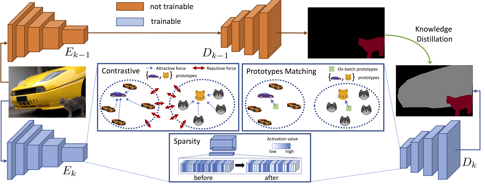

# Continual Semantic Segmentation via Repulsion-Attraction of Sparse and Disentangled Latent Representations
This is the official PyTorch implementation of our work: "Continual Semantic Segmentation via Repulsion-Attraction of Sparse and
Disentangled Latent Representations" published at CVPR 2021.

In this paper, we present some novel approaches constraining the feature space for continual learning semantic segmentation models. 
The evaluation on Pascal VOC2012 and on ADE20K validated our method.

[Paper](https://arxiv.org/abs/2103.06342) <br/>
[5-min video](https://youtu.be/SSG-BZwFOYI) <br/>
[slides](img/slides_static.pdf) <br/>
[poster](img/poster.pdf) <br/>
 <br/>


# Requirements
This repository uses the following libraries:
- Python (3.7.6)
- Pytorch (1.4.0) [tested up to 1.7.1]
- torchvision (0.5.0)
- tensorboardX (2.0)
- matplotlib (3.1.1)
- numpy (1.18.1)
- apex (0.1) [optional]
- [inplace-abn](https://github.com/mapillary/inplace_abn) (1.0.7) [optional]

We also assume to have installed pytorch.distributed package.

All the dependencies are listed in the requirements.txt file which can be used in conda as: <br/>`conda create --name <env> --file requirements.txt`

# How to download data
In this project we use two dataset, ADE20K and Pascal-VOC 2012. 
We provide the scripts to download them in 'data/download_\<dataset_name\>.sh'.
The script takes no inputs and you should use it in the target directory (where you want to download data). 

# How to perform training
The most important file is run.py, that is in charge to start the training or test procedure.
To run it, simpy use the following command:

> python -m torch.distributed.launch --nproc_per_node=\<num_GPUs\> run.py --data_root \<data_folder\> --name \<exp_name\> .. other args ..

The default is to use a pretraining for the backbone used, which is the one officially released by [PyTorch models](https://pytorch.org/vision/stable/models.html) and it will be downloaded automatically.
If you don't want to use pretrained, please use --no-pretrained.

There are many options and you can see them all by using --help option.
Some of them are discussed in the following:
- please specify the data folder using: --data_root \<data_root\> 
- dataset: --dataset voc (Pascal-VOC 2012) | ade (ADE20K)
- task: --task \<task\>, where tasks are
    - 15-5, 15-5s, 19-1 (VOC), 100-50, 100-10, 50, 100-50b, 100-10b, 50b (ADE, b indicates the order)
- step (each step is run separately): --step \<N\>, where N is the step number, starting from 0
- (only for Pascal-VOC) disjoint is default setup, to enable overlapped: --overlapped
- learning rate: --lr 0.01 (for step 0) | 0.001 (for step > 0) 
- batch size: --batch_size 8 (Pascal-VOC 2012) | 4 (ADE20K)
- epochs: --epochs 30 (Pascal-VOC 2012) | 60 (ADE20K)
- method: --method \<method name\>, where names are
    - FT, LWF, LWF-MC, ILT, EWC, RW, PI, MIB, CIL, SDR <br/>
  Note that method overwrites other parameters, but can be used as a kickstart to use default parameters for each method (see more on this in the hyperparameters section below)

For all the details please follow the information provided using the help option.

#### Example training commands

We provide some example scripts in the `*.slurm` and `*.bat` files. <br/>
For instance, to run the step 0 of 19-1 VOC2012 you can run:<br/>
```
python -u -m torch.distributed.launch 1> 'outputs/19-1/output_19-1_step0.txt' 2>&1 \
--nproc_per_node=1 run.py \
--batch_size 8 \
--logdir logs/19-1/ \
--dataset voc \
--name FT \
--task 19-1 \
--step 0 \
--lr 0.001 \
--epochs 30 \
--debug \
--sample_num 10 \
--unce \
--loss_de_prototypes 1 \
--where_to_sim GPU_windows
```
Note: loss_de_prototypes is set to 1 only for having the prototypes computed in the 0-th step (no distillation is actually computed of course).

Then, the step 1 of the same scenario can be computed simply as:
```
python -u -m torch.distributed.launch 1> 'outputs/19-1/output_19-1_step1.txt'  2>&1 \
--nproc_per_node=1 run.py \
--batch_size 8 \
--logdir logs/19-1/ \
--dataset voc \
--task 19-1 \
--step 1 \
--lr 0.0001 \
--epochs 30 \
--debug \
--sample_num 10 \
--where_to_sim GPU_windows \
--method SDR \
--step_ckpt 'logs/19-1/19-1-voc_FT/19-1-voc_FT_0.pth'
```

The results obtained are reported inside the `outputs/` and `logs/` folder, which can be downloaded [here](https://lttm.dei.unipd.it/paper_data/SDR/results.zip), and are 0.4% of mIoU higher than those reported in the main paper due to a slightly changed hyperparameter.

To run other approaches it is sufficient to change the `--method` parameter into one of the following: FT, LWF, LWF-MC, ILT, EWC, RW, PI, MIB, CIL, SDR. 

Note: for the best results, the hyperparameters may change. Please see further details on the hyperparameters section below.


Once you trained the model, you can see the result on tensorboard (we perform the test after the whole training) or on the output files.
 or you can test it by using the same script and parameters but using the option 
> --test

that will skip all the training procedure and test the model on test data.

## Do you want to try our constraints on your codebase or task?

If you want to try our novel constraints on your codebase or on a different problem you can check the `utils/loss.py` file. 
Here, you can take the definitions of the different losses and embed them into your codebase <br/>
The names of the variables could be interpreted as:<br/>
- `targets`-- ground truth map, 
- `outputs`-- segmentation map output from the current network
- `outputs_old`-- segmentation map output from the previous network  
- `features`-- features taken from the end of the currently-trained encoder,  
- `features_old`--   features taken from the end of the previous encoder [used for distillation on the encoder on ILT, but not used on SDR],
- `prototypes`-- prototypical feature representations 
- `incremental_step` -- index of the current incremental step (0 if first non-incremental training is performed)
- `classes_old`-- index of previous classes 

## Range for the Hyper-parameters

For what concerns the hyperparameters of our approach:
- The parameter for the distillation loss is in the same range of that of MiB, 
- Prototypes matching: lambda was searched in range 1e-1 to 1e-3,
- Contrastive learning (or clustering): lambda was searched in the range of 1e-2 to 1e-3,
- Features sparsification: lambda was searched in the range of 1e-3 to 1e-5
A kick-start could be to use KD 10, PM 1e-2, CL 1e-3 and FS 1e-4.<br/>
The best parameters may vary across datasets and incremental setup. 
However, we typically did a grid search and kept it fixed across learning steps.

So, writing explicitly all the parameters, the command would look something like the following:
```
python -u -m torch.distributed.launch 1> 'outputs/19-1/output_19-1_step1_custom.txt'  2>&1 \
--nproc_per_node=1 run.py \
--batch_size 8 \
--logdir logs/19-1/ \
--dataset voc \
--task 19-1 \
--step 1 \
--lr 0.0001 \
--epochs 30 \
--debug \
--sample_num 10 \
--where_to_sim GPU_windows \
--unce \
--loss_featspars $loss_featspars \
--lfs_normalization $lfs_normalization \
--lfs_shrinkingfn $lfs_shrinkingfn \
--lfs_loss_fn_touse $lfs_loss_fn_touse \
--loss_de_prototypes $loss_de_prototypes \
--loss_de_prototypes_sumafter \
--lfc_sep_clust $lfc_sep_clust \
--loss_fc $loss_fc \
--loss_kd $loss_kd \
--step_ckpt 'logs/19-1/19-1-voc_FT/19-1-voc_FT_0.pth'
```

## Cite us
If you use this repository, please consider to cite

       @inProceedings{michieli2021continual,
       author = {Michieli, Umberto and Zanuttigh, Pietro},
       title  = {Continual Semantic Segmentation via Repulsion-Attraction of Sparse and Disentangled Latent Representations},
       booktitle = {Computer Vision and Pattern Recognition (CVPR)},
       year      = {2021},
       month     = {June}
       }
And our previous works [ILT](https://openaccess.thecvf.com/content_ICCVW_2019/html/TASK-CV/Michieli_Incremental_Learning_Techniques_for_Semantic_Segmentation_ICCVW_2019_paper.html) and its [journal extension](https://www.sciencedirect.com/science/article/pii/S1077314221000114).

## Acknowledgements

We gratefully acknowledge the authors of [MiB](https://github.com/fcdl94/MiB) paper for the insightful discussion and for providing the open source codebase, which has been the starting point for our work. <br/>
We also acknowledge the authors of [CIL](https://github.com/ifnspaml/CIL_Segmentation) for providing their code even before the official release.

